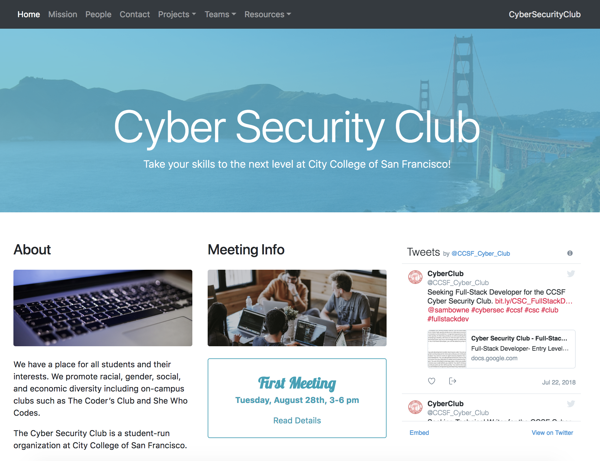

# Cyber Security Club, City College of San Francisco
Welcome to City College of San Francisco's Cyber Security Club's website project. The goal of this project is to create a one-stop shop for students and industry partners to learn about our organization, stay informed about our activities and also participate. 

<kbd></kbd>

## Be a contributor to our website
This website is one of our many projects that we would love for students or prospective tech members to help contribute their skills to build out this website to become a resourceful platform. 

## How to contribute?
* First, set up an account with GitHub
* Contact one of the Club Administrators and they'll invite you to become a contributor
* Next, go to the cyber-security-club repo in GitHub and click on the Issues tab
* You'll see a list of Issues, pick and choose which you'd like to tackle
* Comment to let the Admin know you plan on working on that Issue
* Then, go back to main GitHub page of the repo and clone the project to your local environment
* Create a separate branch for your own work in your local terminal
* Make a commit and push it to your branch in your local terminal
* Go back to the repo in GitHub and make a Pull Request and submit
* Wait until one of the Club Admins review your code and they'll merge it in
* If there are any merge conflicts, the Admin will let you know and it'll be a matter of communicating to fix the changes
* That's about it! Don't be afraid to try to contribute. This a is a space to learn :) 

## Style Guide
The goal is to keep the website as simple and clean. The selection of the color theme with blue is because research shows that the color blue represents a sense of calmness and trust. In addition, we want to make sure that our website account aspects of accessbility, choose color contrast that makes it ok for people who are colorblind. Also, if you input images, make sure you include explain it in the "alt" attribute inside the image tag so that screen readers can explain to those who are blind, what image was supposed to be there. For example, if it's a photo a someone, write that person's name down.

* If you're updating an image or adding another card and image for the People section, the image size is 800x480 pixels (please edit in Photoshop or another image editor and keep color tone of the images consistant)
* Images in the About, Meeting Info, Projects and Teams sections, it's 1024×436 pixels

## Live website link
https://aeimskei.github.io/cyber-security-club/
